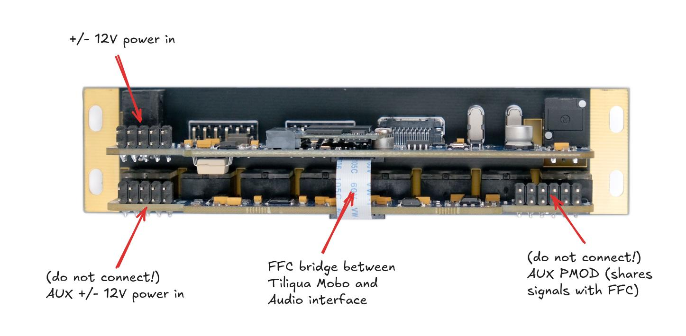

Connections
###########

Connections: Front
------------------

.. image:: _static/tiliqua_front_labelled.png
  :width: 800

Connections: Back
-----------------

Power: connecting +/- 12V
-------------------------

.. warning::

    Tiliqua uses an ordinary 10-pin power cable for +/- 12V ingress. You will notice however, that there are 2 such connectors on the module. **Only ONE of these should be connected**:

    - Use the 10-pin power ingress **on the Tiliqua Motherboard, not the Audio Interface Board**. Technically both will work, but only the former is fused.
    - Both connectors on the audio interface board (eurorack-pmod) should remain unconnected.
    - Make sure the red stripe on the IDC cable is aligned with the RED marker on the PCB.

USB: the ``dbg`` and ``usb2`` ports
-----------------------------------

For flashing bitstreams, you want the ``dbg`` USB port. This is routed to the on-board RP2040 which is flashed with ``dirtyJtag``, which allows flashing the SPI flash with ``openFPGALoader``.

For USB audio or USB device / host usage from bitstreams, you want the ``usb2`` USB port. This is routed through a ULPI PHY directly to the FPGA fabric.

Audio jacks: for touch, disconnect on boot
------------------------------------------

When using bitstreams with touch sensing, **ensure all jacks are disconnected before the tiliqua is powered on**. This is because the capacitive sensing is calibrated when the system boots. In the future, re-calibration will happen every time something is dis/re-connected, but this is not the case yet.

Display/DVI: disconnect when system off
---------------------------------------

External displays (e.g. external monitors not sharing Eurorack power) may leak a small current to the FPGA through the DVI termination resistors if Tiliqua is off. This will not affect Tiliqua operation, but may affect the 3V3 supply on PMOD expansion modules. By always **disconnecting the display when your eurorack system is off**, you can avoid this leakage current.
