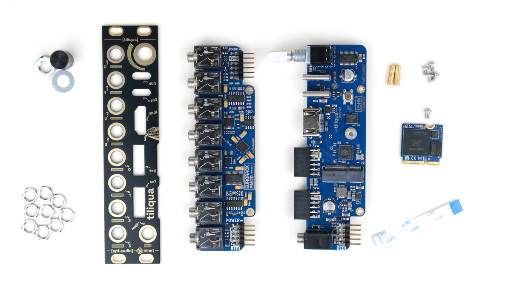

Tiliqua Project
###############

**Tiliqua** is a powerful, hackable FPGA-based audio multitool for Eurorack. Our aim is to make FPGA-based audio and video synthesis more accessible (and fun!). Tiliqua allows 8 bitstreams to be stored simultaneously, with the outputs soft-muted if bitstreams are changed on the fly. That is, the hardware is fully reconfigurable during live performance.

.. warning::

   This manual is **intended for developers and very incomplete**! It currently assumes you are running a Linux machine, have some knowledge of the Amaranth HDL and Rust, and have some familiarity with the open-source FPGA tooling. Simpler tutorials (and support for Windows/Mac) is planned but not yet ready.

.. toctree::
   :caption: Keep Updated
   :maxdepth: 2

   devlog/index
   community
   foss_funding

.. toctree::
   :caption: Hardware
   :maxdepth: 2

   connections
   hardware_design
   hardware_changes

.. toctree::
   :caption: Building & Flashing
   :maxdepth: 3

   install
   gettingstarted/index
   calibration
   bootloader
   examples/index

.. toctree::
   :caption: Reference
   :maxdepth: 3

   dsp/index

.. toctree::
   :caption: Links
   :maxdepth: 2

   Tiliqua on Crowd Supply <https://www.crowdsupply.com/apfaudio/tiliqua>
   Tiliqua on GitHub <https://github.com/apfaudio/tiliqua>
   Homepage (apf.audio) <https://apf.audio/>
